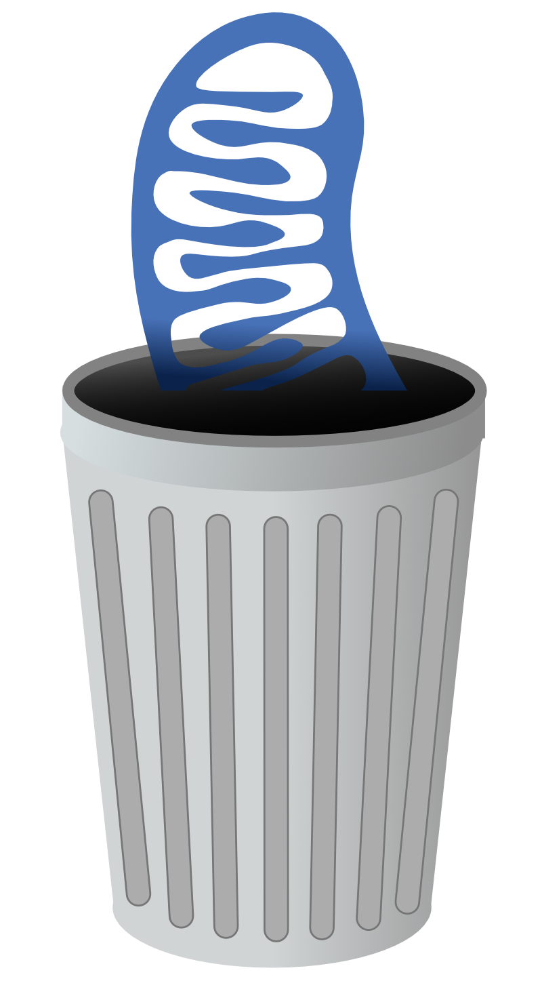

# numty-dumpty
Nextflow pipeline to clean up non-human reference genomes and annotations
<p align="center">

</p>

* Filters the reference genome and annotation to exclude unwanted sequences (*e.g.* unplaced scaffolds and alternate contigs) and sequences below a set length (which can break ATAC-seq analysis tools)
* Finds candidate [NUMTs](https://www.ncbi.nlm.nih.gov/pmc/articles/PMC7671390/) in the genome using the approach suggested [here](https://github.com/caleblareau/mitoblacklist) and outputs a mask in BED format and a hard-masked version of the reference
* Finds runs of low-mappbility sequence in the reference genome using [GenMap](https://github.com/cpockrandt/genmap) and outputs a mask in BED format and a hard-masked version of the reference
* Removes autosomal gene annotations that are homologous to human mitochondrial genes (from [GENCODE v46](https://www.gencodegenes.org/human/))
* Re-annotates the mitochondrial genome using human mitochondrial annotations from [GENCODE v46](https://www.gencodegenes.org/human/) and [liftOff](https://github.com/agshumate/Liftoff)

## Installation
* Install [conda](https://github.com/conda-forge/miniforge)
* Clone this repository
  
```
cd numty-dumpty
conda env create --file=numty-dumpty.yml
```
This will create a conda environment called `numty-dumpty`

## Running
This is a [Nextflow](https://www.nextflow.io/) pipeline. Nextflow should install with the conda environment, and you can run like this:
```
conda activate numty-dumpty
./numty-dumpty.nf -params-file [params.yml]
```
Where `[params.yml]` is a [YAML](https://www.cloudbees.com/blog/yaml-tutorial-everything-you-need-get-started) file listing parameters. You can see default values for the parameters by looking in `nextflow.config`.

There is an example `[params.yml]` file included in this directory: just copy `example.yml` wherever you like, change the values, delete optional parameters you don't want to specify, and delete or ignore the comments.

You are required to provide a FASTA reference genome, but providing an annotation is optional (without an annotation, only the BED files and masked FASTA files will be created). Annotations can be provided in either [GTF](https://genome.ucsc.edu/FAQ/FAQformat.html#format4) or [GFF3](https://genome.ucsc.edu/FAQ/FAQformat.html#format3) format, and either uncompressed or (b)gzip-compressed.

One thing to double-check, if supplying an annotation, is the name of the field (in the 9th column) used to supply the gene IDs (default is `gene_id`) and the name used to supply gene names (default is `gene_name`). This pipeline seeks to match genes to their human homologs by comparing both gene IDs and gene names. These can vary from annotation to annotation: for example, `gff3` files from [CAT](https://github.com/ComparativeGenomicsToolkit/Comparative-Annotation-Toolkit) use the field `source_gene` to list the Ensembl gene ID for the homologous human gene and the field `source_gene_common_name` to list the names of these genes. If you are using a CAT annotation, setting the parameter `cat` to `true` will automatically set these two fields. 

## Output
This will create the following output files:
* `[genome]_filt.fa.gz`: a [bgzip](http://www.htslib.org/doc/bgzip.html)-compressed version of the input reference genome, with small and unwanted scaffolds removed
* `[genome]_filt_numt.bed`: a [BED](https://genome.ucsc.edu/FAQ/FAQformat.html#format1) file of candidate NUMTs
* `[genome]_filt_lowMap_k[K]_[R].bed`: a [BED](https://genome.ucsc.edu/FAQ/FAQformat.html#format1) file of low-mappability regions, using `[K]`-length k-mers and requiring runs to be at least `[R]` bases long
* `[genome]_filt_numtmask.fa.gz` The filtered genome, with NUMT sequences hard-masked (converted to N)
* `[genome]_filt_numtmask_mapmask.fa.gz` The filtered genome, with NUMT and low-mappability sequences hard-masked (converted to N)
* `[annotation]_filt.[gff3/gtf].gz`: a [bgzip](http://www.htslib.org/doc/bgzip.html)-compressed version of the input annotation, with small and unwanted scaffolds removed
* `[annotation]_filt_noNumt_MTfix.[gff3/gtf].gz`: a version of the input annotation, with small and unwanted scaffolds removed, genes corresponding to human-annotated mitochondrial genes removed from the autosomes, and the mitochondrion re-annotated by lifting over human mitochondrial genes


